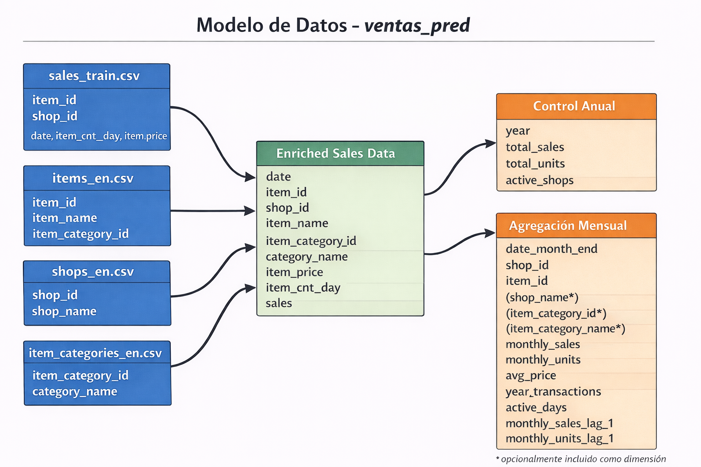

# Tarea 03 – Métodos de Gran Escala Best Practices

Esta carpeta contiene la **Tarea 03** del curso **Métodos de Gran Escala**.  
El objetivo de esta tarea es implementar un **pipeline reproducible de datos y modelado**, siguiendo buenas prácticas de ingeniería de datos y MLOps.

---

## Estructura del proyecto

```
tarea-03/
│
├── notebooks/          # Notebooks de exploración, EDA y prototipos
│
├── data/               # Datos del proyecto
│   ├── raw/            # Datos originales (sin modificar)
│   ├── prep/           # Datos preparados para modelado
│   ├── inference/      # Datos para inferencia batch
│   └── predictions/    # Salidas de predicción batch
│
├── src/                # Código productivo (scripts)
│   ├── etl.py          # Pipeline de extracción y preparación
│   ├── features.py     # Feature engineering
│   ├── train.py        # Entrenamiento del modelo
│   └── predict.py      # Inferencia batch
│
├── artifacts/          # Artefactos generados
│   ├── models/         # Modelos entrenados
│   ├── reports/        # Reportes y gráficos
│   └── metrics/        # Métricas y evaluaciones
│
├── pyproject.toml      # Definición de dependencias
├── uv.lock             # Lockfile para reproducibilidad
└── README.md           # Este archivo
```

## Convenios del proyecto

Este proyecto sigue una serie de **convenios estándar** para asegurar orden, reproducibilidad y escalabilidad.

---

### 📂 Organización de carpetas

- **`notebooks/`**
  - Uso exclusivo para:
    - EDA
    - Análisis exploratorio
    - Pruebas y prototipos
  - No debe contener lógica productiva final.

- **`src/`**
  - Contiene únicamente **código productivo**.
  - Cada script debe ser:
    - Reproducible
    - Ejecutable
    - Independiente del entorno interactivo.
  - No se ejecutan notebooks en producción.

- **`data/`**
  - `raw/`: datos originales (solo lectura).
  - `prep/`: datos transformados y listos para modelado.
  - `inference/`: datos usados para predicción batch.
  - `predictions/`: resultados de inferencia.

- **`artifacts/`**
  - Modelos entrenados
  - Reportes
  - Gráficos
  - Métricas
  - Cualquier salida generada por el pipeline

---

## Modelo de datos (ventas_pred)

Este es el modelo de datos utilizado en el pipeline de **ventas_pred** (ETL + agregación mensual con lags):



### 🧪 Manejo de datos

- Los datos **no se versionan** en Git.
- Solo se versiona la **estructura de carpetas**.
- El formato estándar para datos intermedios es **Parquet**.
- Los CSV solo se permiten en `raw/` si vienen de la fuente original.

---

### 📦 Dependencias y entorno

- El proyecto utiliza **`uv`** para manejo de dependencias.
El proyecto incluye:
  - `pyproject.toml`
  - `uv.lock`
  
Principales librerías:

- boto3 (>= 1.42.34)
- jupyterlab (>= 4.5.2)
- kaggle (>= 1.8.3)
- lightgbm (>= 4.6.0)
- matplotlib (>= 3.10.8)
- numpy (>= 2.4.1)
- pandas (>= 3.0.0)
- pyarrow (>= 23.0.0)
- scikit-learn (>= 1.8.0)


### Instalación del ambiente

Desde la carpeta de la tarea/proyecto:

bash
uv sync

Este comando:
	•	Crea el entorno virtual si no existe
	•	Instala las dependencias definidas en pyproject.toml
	•	Garantiza reproducibilidad usando uv.lock

## Detalle de la ejecución del proyecto

Esta sección describe **cómo ejecutar el pipeline del proyecto** de forma correcta y reproducible, siguiendo los convenios definidos.

---

### 📍 Punto de partida

Todos los comandos deben ejecutarse **desde la raíz de la tarea**, por ejemplo:

bash
cd tareas/tarea-03
uv sync
uv run python src/etl.py
uv run python src/features.py
uv run python src/train.py
uv run python src/predict.py

Flujo recomendado: 

raw → etl → prep → features → train → model → predict → predictions

## Autor

	•	José Antonio Esparza
	•	Gustavo Pardo

- Repositorio desarrollado como parte del curso Métodos de Gran Escala.
