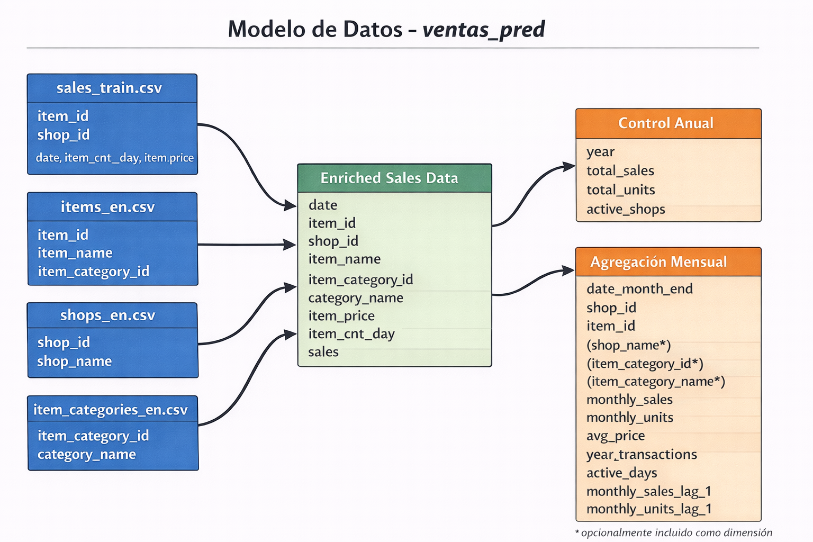
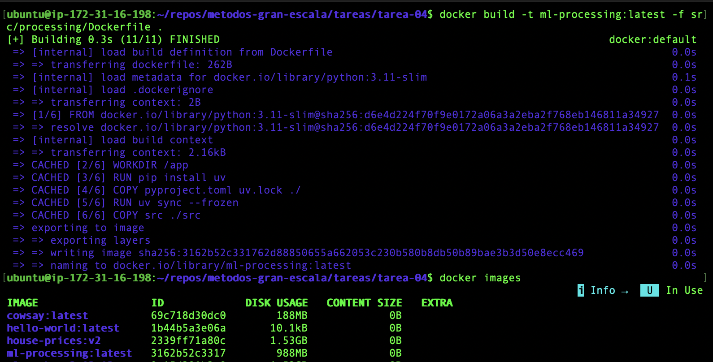
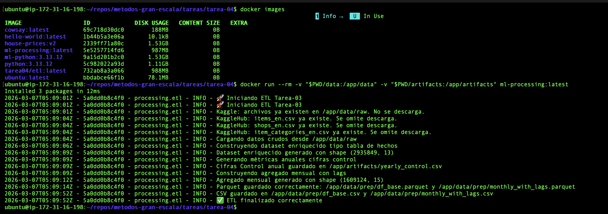
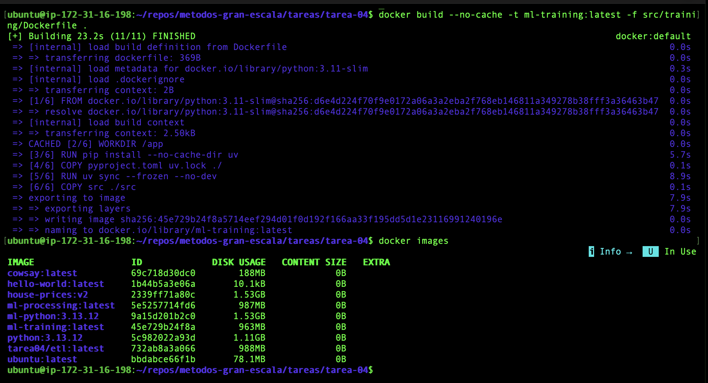
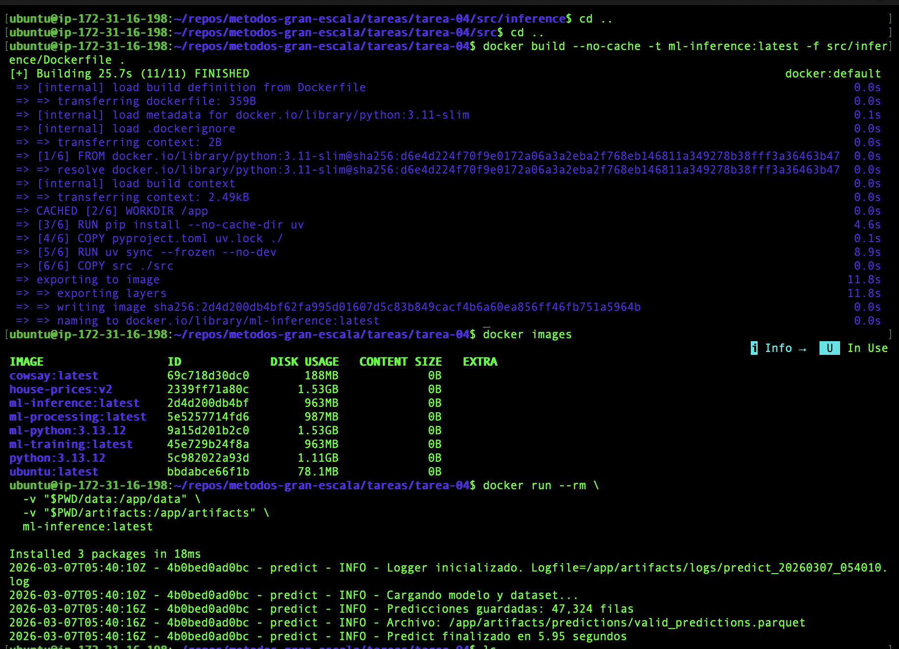
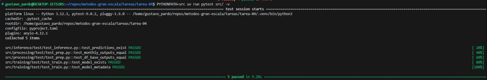
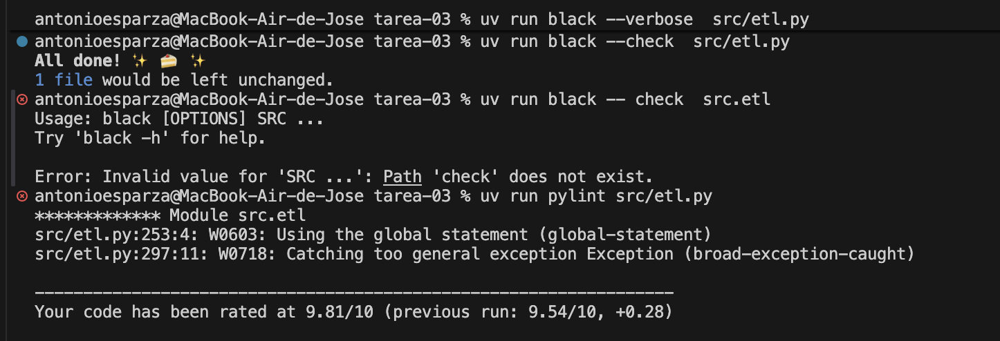

# Tarea 04 - MLOps en Práctica — Docker, Git Workflow y Testing
 
El objetivo de esta tarea es implementar un **pipeline reproducible de datos y modelado**, siguiendo buenas prácticas de ingeniería de datos y MLOps.

---
## 📂 Estructura del Proyecto


```
tarea-04/
├── artifacts
│   ├── figures
│   ├── logs
│   │   ├── etl.log
│   │   ├── evaluate_20260207_085857.log
│   │   ├── predict_20260207_085856.log
│   │   └── train_20260207_085839.log
│   ├── models
│   │   ├── lgbm_weekly_v1_info.json
│   │   ├── lgbm_weekly_v1.pkl
│   │   ├── model_info.json
│   │   └── model.pkl
│   ├── predictions
│   │   └── valid_predictions.parquet
│   ├── reports
│   │   ├── eda_demand_distribution.png
│   │   ├── estacionalidad.png
│   │   ├── metrics.json
│   │   ├── modelos_images.png
│   │   └── pareto.png
│   └── yearly_control.csv
├── data
│   ├── inference
│   ├── predictions
│   ├── prep
│   │   ├── df_base_new.parquet
│   │   ├── df_base_old.parquet
│   │   ├── df_base.csv
│   │   ├── df_base.parquet
│   │   ├── monthly_with_lags.csv
│   │   └── monthly_with_lags.parquet
│   └── raw
│       ├── item_categories_en.csv
│       ├── item_categories.csv
│       ├── items_en.csv
│       ├── items.csv
│       ├── sales_train.csv
│       ├── sample_submission.csv
│       ├── shops_en.csv
│       ├── shops.csv
│       └── test.csv
├── notebooks
│   ├── 00_etl.ipynb
│   ├── 01_eda.ipynb
│   ├── 02_feature_engineering.ipynb
│   ├── 03_modeling.ipynb
│   └── 04_evaluation.ipynb
├── pyproject.toml
├── README.md
├── Resumen_Ejecutivo.md
├── src
│   ├── __init__.py
│   ├── config.py
│   ├── inference
│   │   ├── __init__.py
│   │   ├── __main__.py
│   │   ├── Dockerfile
│   │   ├── predict.py
│   │   └── test
│   │       └── test_inference.py
│   ├── logging_config.py
│   ├── main.py
│   ├── processing
│   │   ├── __init__.py
│   │   ├── __main__.py
│   │   ├── Dockerfile
│   │   ├── etl.py
│   │   ├── features.py
│   │   └── test
│   │       └── test_prep.py
│   └── training
│       ├── __init__.py
│       ├── __main__.py
│       ├── Dockerfile
│       ├── evaluate.py
│       ├── test
│       │   └── test_train.py
│       └── train.py
└── uv.lock
```

## Convenios del proyecto

Este proyecto sigue una serie de **convenios estándar** para asegurar orden, reproducibilidad y escalabilidad.

---

### 📂 Organización de carpetas

- **`notebooks/`**
  - Uso exclusivo para:
    - EDA
    - Análisis exploratorio
    - Pruebas y prototipos
  - No debe contener lógica productiva final.

- **`src/`**
  - Contiene únicamente **código productivo**.
  - Cada script debe ser:
    - Reproducible
    - Ejecutable
    - Independiente del entorno interactivo.
  - No se ejecutan notebooks en producción.

- **`data/`**
  - `raw/`: datos originales (solo lectura).
  - `prep/`: datos transformados y listos para modelado.
  - `inference/`: datos usados para predicción batch.
  - `predictions/`: resultados de inferencia.

- **`artifacts/`**
  - Modelos entrenados
  - Reportes
  - Gráficos
  - Métricas
  - Cualquier salida generada por el pipeline

---

## 🔄 Flujo del Pipeline

```
Raw Data (data/raw)
    ↓
ETL (src/processing/etl.py)
    ↓
Feature Engineering (src/processing/features.py)
    ↓
Training (src/training/train.py)
    ↓
Evaluation (src/training/evaluate.py)
    ↓
Inference (src/inference/predict.py)
    ↓
Predictions (artifacts/predictions)

## 🔀 Git Workflow

El proyecto sigue una estrategia basada en ramas para garantizar orden, trazabilidad y control en el desarrollo del pipeline de ML.

### 📌 Estructura de ramas

```
main
  ↑
development
  ↑
feature/<nombre-modulo>

---

## Modelo de datos (ventas_pred)

Este es el modelo de datos utilizado en el pipeline de **ventas_pred** (ETL + agregación mensual con lags):



### 🧪 Manejo de datos

- Los datos **no se versionan** en Git.
- Solo se versiona la **estructura de carpetas**.
- El formato estándar para datos intermedios es **Parquet**.
- Los CSV solo se permiten en `raw/` si vienen de la fuente original.

---

### 📦 Dependencias y entorno

- El proyecto utiliza **`uv`** para manejo de dependencias.
El proyecto incluye:
  - `pyproject.toml`
  - `uv.lock`
  
Principales librerías:

- black (>= 26.1.0)
- boto3 (>= 1.42.44)
- joblib (>= 1.4.2)
- jupyterlab (>= 4.5.3)
- kaggle (>= 1.8.4)
- kagglehub (>= 0.4.3)
- lightgbm (>= 4.6.0)
- matplotlib (>= 3.10.8)
- numpy (>= 2.4.2)
- pandas (>= 3.0.0)
- pre-commit (>= 4.5.1)
- pyarrow (>= 23.0.0)
- pyyaml (>= 6.0.3)
- ruff (>= 0.15.0)
- scikit-learn (>= 1.8.0)
- seaborn (>= 0.13.2)

Dependencias de desarrollo:

- pylint (>= 3.2.7)
- pytest (>= 9.0.2)


### Instalación del ambiente

1. **Clona el repositorio desde EC2:**

   ```bash
   git clone https://github.com/gustavopardoitam/metodos-gran-escala.git
   cd metodos-gran-escala/tareas/tarea-04
   ```

2. **Ejecución con Docker:**

   Construye y ejecuta los contenedores para cada etapa del pipeline:

   ```bash
   # Processing (ETL y Feature Engineering)
   docker build -t ml-processing:latest -f src/processing/Dockerfile .
   docker run --rm -v "$PWD/data:/app/data" -v "$PWD/artifacts:/app/artifacts" ml-processing:latest

   # Training
   docker build --no-cache -t ml-training:latest -f src/training/Dockerfile .
   docker run --rm \
     -v "$PWD/data:/app/data" \
     -v "$PWD/artifacts:/app/artifacts" \
     ml-training:latest

   # Inference
   docker build --no-cache -t ml-inference:latest -f src/inference/Dockerfile .
   docker run --rm \
     -v "$PWD/data:/app/data" \
     -v "$PWD/artifacts:/app/artifacts" \
     ml-inference:latest
   ```

## 🐳 Evidencia de Contenedores Docker

Esta sección incluye capturas de pantalla como evidencia de la creación y ejecución exitosa de los tres contenedores Docker utilizados en el pipeline.

### Contenedor de Processing (ETL y Feature Engineering)



### Ejecución con Argumentos, Hiperparámetros y Logging



### Contenedor de Training



### Contenedor de Inference



## Detalle de la ejecución del proyecto

Esta sección describe **cómo ejecutar el pipeline del proyecto** de forma correcta y reproducible, siguiendo los convenios definidos.

---

### 📍 Punto de partida

Todos los comandos deben ejecutarse **desde la raíz de la tarea-04**, por ejemplo:

```bash
cd tareas/tarea-04
uv sync
uv run python src/processing/etl.py
uv run python src/processing/features.py
uv run python src/training/train.py
uv run python src/inference/predict.py
```


## 🧪 Pruebas Unitarias

Los tests deben vivir dentro de cada step, **no** en una carpeta global de tests:

```
src/
├── processing/
│ ├── etl.py
│ ├── features.py
│ ├── Dockerfile
│ └── test/
│ └── test_prep.py ← tests del step de processing
├── training/
│ ├── train.py
│ ├── evaluate.py
│ ├── Dockerfile
│ └── test/
│ └── test_train.py ← tests del step de training
└── inference/
├── predict.py
├── Dockerfile
└── test/
└── test_inference.py ← tests del step de inference
```

### Qué probar

Para probar **funciones de Python** (no el flujo completo del pipeline). Algunos ejemplos:

- Funciones de limpieza de datos 
- Transformaciones de features 
- Funciones de métricas o evaluación del modelo

**Ejemplo de prueba unitaria:**

```python
# src/inference/test/test_inference.py
from pathlib import Path

def test_predictions_exist():
    pred_path = Path("artifacts/predictions/valid_predictions.parquet")
    assert pred_path.exists(), "No existen predicciones generadas"
```

### Evidencia de Pruebas Unitarias



## ✅ Calidad del código y Linting

Para garantizar **calidad, consistencia y mantenibilidad** del código, este proyecto adopta herramientas de **linting y formateo automático**. Estas prácticas ayudan a detectar errores temprano, mantener un estilo uniforme y facilitar el trabajo colaborativo.

### 🎯 Objetivos

- Detectar errores antes de ejecutar el código
- Mantener un estilo consistente en todo el proyecto
- Seguir las mejores prácticas de Python (PEP 8)
- Reducir fricción en revisiones de código (code reviews)
- Facilitar la transición de notebooks experimentales a código de producción

---

### 🔍 Linters y Formatters

Es importante distinguir entre dos tipos de herramientas:

#### Linters (detectan problemas)
- Analizan el código para detectar errores, malas prácticas y problemas de estilo. 

#### Formatters (corrigen el formato)
- Reformatean el código para seguir un estilo consistente
-- **Modifican** el código automáticamente

### Resultado de la evaluación

La siguiente imagen muestra el resultado de la evaluación de calidad del código aplicada al módulo de producción:



## Autor

	•	José Antonio Esparza
	•	Gustavo Pardo

- Repositorio desarrollado como parte del curso Métodos de Gran Escala.
